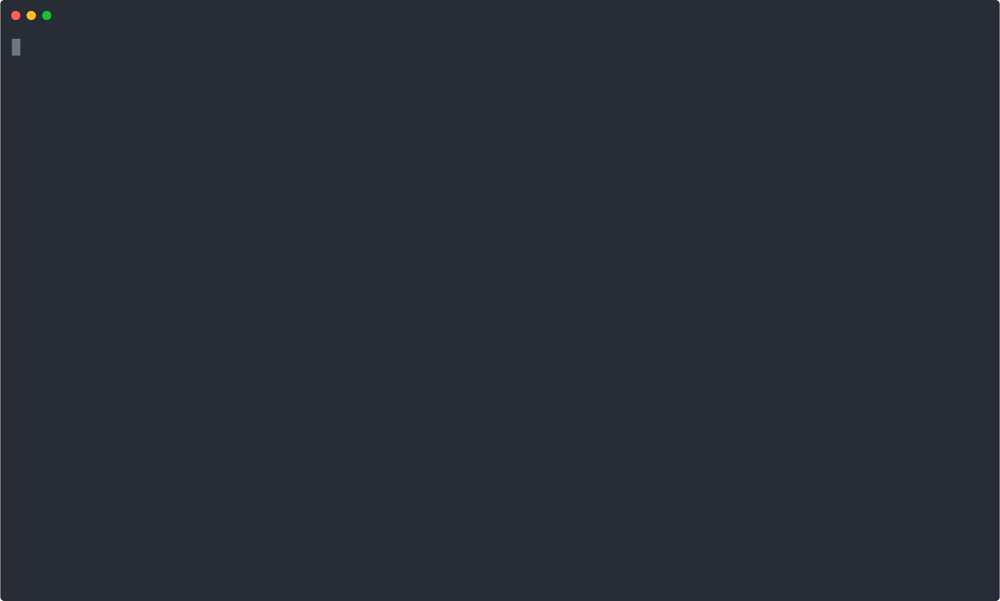

# example-cli

> Simple example CLI using
> [dynamic-cli-framework](https://github.com/flowscripter/dynamic-cli-framework).

## Binary Executable Usage

**NOTE**: The binaries are 10's of megabytes in size as the entire Bun runtime
is included.

#### MacOS

Via [Homebrew](https://brew.sh/):

`brew install flowscripter/tap/example-cli`

#### Linux

In a terminal:

`curl -fsSL https://raw.githubusercontent.com/flowscripter/example-cli/main/script/install.sh | sh`

#### Windows

In PowerShell:

`curl -fsSL https://raw.githubusercontent.com/flowscripter/example-cli/main/script/install.ps1 | powershell`

#### Manual Install

You can download and extract the binary zip files from the
[releases](https://github.com/flowscripter/example-cli/releases)
page.

## Functional Tests

Refer to [functional_tests/README.md](functional_tests/README.md)

## Development

Test:

`bun test`

Run:

`bun run index.ts`

> During development this can be used to validate command definitions:
>
> `CLI_VALIDATE_ALL=1 bun run index.ts`

> During development this can be used to enable framework logging:
>
> `CLI_DEBUG=1 bun run index.ts`

Compile binary:

`bun build index.ts --compile --outfile /tmp/example-cli`

**NOTE**: The following tasks use Deno as it excels at these and Bun does not
currently provide such functionality:

Format:

`deno fmt`

Lint:

`deno lint index.ts src/ tests/`

Generate HTML API Documentation:

`deno doc --html --name=example-cli index.ts`

## Documentation

Refer to the
[dynamic-cli-framework](https://github.com/flowscripter/dynamic-cli-framework)
documentation.

### API

Link to auto-generated API docs:

[API Documentation](https://flowscripter.github.io/example-cli/index.html)

## License

MIT © Flowscripter
