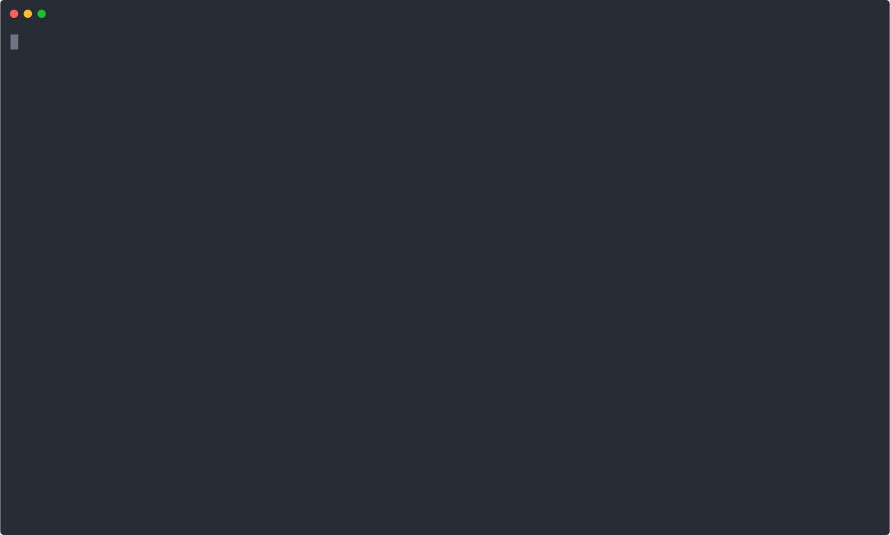

# example-cli

> Simple example CLI using [dynamic-cli-framework](https://github.com/flowscripter/dynamic-cli-framework).

## Binary Executable Usage

Download and extract zip from: https://github.com/flowscripter/example-cli/releases

Run the executable: `./example-cli`

**NOTE**: Due to this issue https://github.com/denoland/deno/issues/11154 the MacOS executable
is neither signed nor notarised. This means a "Developer cannot be verified" error will be displayed when the CLI
it is executed. This requires explicitly allowing the CLI to be executed via:

_"System Settings" > "Privacy & Security" > "Security" > "Allow Anyway"_

## Development

Run: `deno run --allow-env mod.ts`

> During development this can be used to validate command definitions:
> 
> `CLI_VALIDATE_ALL=1 deno run --allow-env mod.ts`

> During development this can be used to enable framework logging:
> 
> `CLI_DEBUG=1 deno run --allow-env mod.ts`

Test: `deno test -A`

Lint: `deno fmt mod.ts deps.ts src/ tests/`

Compile: `deno compile --allow-env mod.ts`

## Functional Tests

Refer to [functional_tests/README.md](functional_tests/README.md)

## Documentation

Refer to the [dynamic-cli-framework](https://github.com/flowscripter/dynamic-cli-framework) documentation.

## License

MIT © Flowscripter
